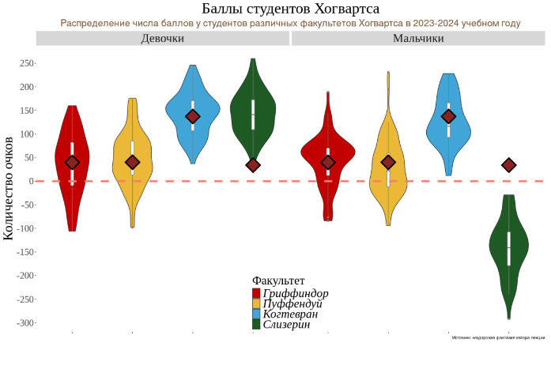

```{r setup & load packages, include=FALSE}
knitr::opts_chunk$set(echo = TRUE, message = FALSE, warning = FALSE, error = FALSE, fig.width=16, fig.height=10)

library(tidyverse)
library(ggExtra)
library(ggridges)
library(ggpubr)
library(gridExtra)

# Избавляемся от scientific notation
options(scipen = 999)

hogwarts <- read_csv("data/hogwarts_2024.csv")
hogwarts |> head()

hogwarts |> glimpse()

# Changing some variables type to factors
hogwarts <- hogwarts |> mutate(
  across(c(house, course, sex, wandCore, bloodStatus), ~ as.factor(.x))
)

sum(is.na(hogwarts))

hogwarts |> summary()

theme_custom <- theme(
    panel.background = element_rect(fill = "white"),
    plot.title = element_text(size = 30, hjust = 0.5),
    plot.subtitle = element_text(size = 25, hjust = 0.5),
    strip.text = element_text(size = 20),
    axis.text = element_text(size = 20),
    axis.title = element_text(size = 25),
    legend.title = element_text(size = 25),
    legend.text = element_text(size = 20)
  )
hogwarts %>% select(is.factor)
```

# Диаграммы рассеяния (скаттерплоты)
## Задание 1
Постройте скаттерплот, визуализирующий связь между суммарным баллом студента за год и оценкой за экзамен по травологии. Добавьте на график линию тренда. Удалите доверительную область и сделайте линию прямой. Подумайте, как избежать того, чтобы записать одни и те же координаты x и y дважды. Проинтерпретируйте график.

```{r}
hogwarts |> 
  ggplot()+
  geom_point(aes(x = result, 
                 y = `Herbology exam`))+
  geom_smooth(aes(x = result,
                  y = `Herbology exam`),
              method = "lm",
              se = FALSE,
              colour = "aquamarine")+
  theme_custom
#Избежать повторения координат можно, если перенести эстетику в ggplot
hogwarts |> 
  ggplot(aes(x = result, 
                 y = `Herbology exam`))+
  geom_point()+
  geom_smooth(method = "lm",
              se = FALSE,
              colour = "aquamarine")+
  theme_custom
```
Интерпретация: существует положительная корреляция между суммарным балом студента и результатами на экзамене по травологии, что логично: суммарный бал будет увеличиваться, чем лучше результаты студента по экзамену.

## Задание 2
Отобразите на одной иллюстрации скаттерплоты, аналогичные тому, что вы делали на первом задании, для экзаменов по травологии, магловедению, прорицаниям и зельеварению. На иллюстрации также должна присутствовать линия тренда с характеристиками, аналогичными тем, что были в пункте 1. Раскрасьте точки в разные цвета, в соответствии с факультетами. Используйте стандартные цвета факультетов (как в лекционных rmd). Проинтерпретируйте полученный результат. Создайте иллюстрацию из этого пункта, используя только пакеты семейства tidyverse, и не привлекая дополнительные средства.

```{r, fig.width=8, fig.height=5}
muggle <- ggplot(hogwarts, aes(x = result, y = `Muggle studies exam`, color = house)) +
  geom_point(size = 3) +
  geom_smooth(method = "lm", se = FALSE, color = "black") +
  scale_color_manual(values = c("Gryffindor" = "#C50000", 
                           "Hufflepuff" = "#ECB939", 
                           "Ravenclaw" = "#41A6D9", 
                           "Slytherin" = "#1F5D25")) +
  labs(title = "Зависимость между \nрезультатами за экзамен по \nмалговеденью и итоговым \nбаллом",
       x = "Итоговый балл",
       y = "Магловедение") +
  theme_bw()

potions <- ggplot(hogwarts, aes(x = result, y = `Potions exam`, color = house)) +
  geom_point(size = 3) +
  geom_smooth(method = "lm", se = FALSE, color = "black") +
  scale_color_manual(values = c("Gryffindor" = "#C50000", 
                           "Hufflepuff" = "#ECB939", 
                           "Ravenclaw" = "#41A6D9", 
                           "Slytherin" = "#1F5D25")) +
  labs(title = "Зависимость между \nрезультатами за экзамен по \nзельеварению и итоговым \nбаллом",
       x = "Итоговый балл",
       y = "Зельеварение") +
  theme_bw()

herbology <- ggplot(hogwarts, aes(x = result, y = `Herbology exam`, color = house)) +
  geom_point(size = 3) +
  geom_smooth(method = "lm", se = FALSE, color = "black") +
  scale_color_manual(values = c("Gryffindor" = "#C50000", 
                           "Hufflepuff" = "#ECB939", 
                           "Ravenclaw" = "#41A6D9", 
                           "Slytherin" = "#1F5D25")) +
  labs(title = "Зависимость между \nрезультатами за экзамен по \nтравологии и итоговым \nбаллом",
       x = "Итоговый балл",
       y = "Травология") +
  theme_bw()

arithmancy <-  ggplot(hogwarts, aes(x = result, y = `Arithmancy exam`, color = house)) +
  geom_point(size = 3) +
  geom_smooth(method = "lm", se = FALSE, color = "black") +
  scale_color_manual(values = c("Gryffindor" = "#C50000", 
                           "Hufflepuff" = "#ECB939", 
                           "Ravenclaw" = "#41A6D9", 
                           "Slytherin" = "#1F5D25")) +
  labs(title = "Зависимость между \nрезультатами за экзамен по \nпредсказаниям и итоговым \nбаллом",
       x = "Итоговый балл",
       y = "Прорицания") +
  theme_bw()

ggarrange(muggle, potions, herbology, arithmancy, ncol = 2, nrow = 2, common.legend = TRUE, legend = "right")

# Комбинируем графики выше в единую иллюстрацию с помощью фасетирования
hogwarts %>% 
  select(c(`Herbology exam`, `Muggle studies exam`, `Divinations exam`, `Potions exam`, result, house)) %>% 
  pivot_longer(cols = c(`Herbology exam`, `Muggle studies exam`, `Divinations exam`, `Potions exam`),
               names_to = "exam",
               values_to = "score") %>% 
  mutate(exam = factor(exam, levels = c("Herbology exam", "Muggle studies exam", "Divinations exam", "Potions exam"))) %>% 
  ggplot(aes(x = result, y = score, color = house)) +
  geom_point(size = 3) +
  geom_smooth(method = "lm", se = FALSE, color = "black") +
  scale_color_manual(values = c("Gryffindor" = "#C50000", 
                                "Hufflepuff" = "#ECB939", 
                                "Ravenclaw" = "#41A6D9", 
                                "Slytherin" = "#1F5D25")) +
  facet_wrap(~ exam, scales = "free", ncol = 2, 
             labeller = as_labeller(c(`Herbology exam` = "Травология", 
                                      `Muggle studies exam` = "Магловедение", 
                                      `Divinations exam` = "Прорицания", 
                                      `Potions exam` = "Зельеварение"))) +
  labs(title = "Связь между оценками по разным предметам и итоговым баллом",
       x = "Итоговый балл",
       y = "Оценка за экзамен") +
  theme_bw() #Для человекочитабельности установил чернобелую тему

theme_custom <- theme(
    panel.background = element_rect(fill = "white"),
    plot.title = element_text(size = 25, hjust = 0.5),
    plot.subtitle = element_text(size = 25, hjust = 0.5),
    strip.text = element_text(size = 20),
    axis.text = element_text(size = 20),
    axis.title = element_text(size = 25),
    legend.title = element_text(size = 25),
    legend.text = element_text(size = 20)
  )
# Экстракция слизеринцев и их результатов по травологии против итогового балла
hogwarts %>% filter(house == "Slytherin") %>% 
  ggplot(aes(x = result, y = `Potions exam`)) +
  geom_point(size = 3, colour = "#1F5D25") +
  geom_smooth(method = "lm", se = FALSE, color = "black") +
  labs(title = "Зависимость между результатами\n за экзамен по зельеварению\n студентов Слизерина и\n итоговый балл",
       x = "Итоговый балл",
       y = "Зельевариение") +
  theme_custom
```
Итерпретация последнего (комбинированного) графика: По предметам существует положительная корреляция между итоговым баллом и оценкой за экзамен, кроме экзамена по зельеварению, где существует отрицательный тренд, при этом результаты студентов слизерина "выбиваются" из общей группы, отчего были вынесены на отдельный график. Итересна природа деления результатов на две группы.

## Задание 3
Видоизмените график, полученный на предыдущем шаге. Сгруппируйте и покрасьте линии тренда в соответствии с одной из категориальных переменных (с такой, которая подсвечивает одно из наблюдений на предыдущем этапе, относящееся ко всем 4-м экзаменам). Постарайтесь избежать коллизий в легенде, при этом сохранив и цветовую палитру для раскраски точек по факультетам.

```{r, fig.width=8, fig.height=5}
# На сколько я понял, нужно создать новую категориальную переменную - слизеринец, неслизеринец
hogwarts %>% 
  select(c(`Herbology exam`, `Muggle studies exam`, `Divinations exam`, `Potions exam`, result, house, bloodStatus)) %>%
  mutate(Slytherin = ifelse(house == "Slytherin", "Slytherin", "Non-Slytherin")) %>% 
  mutate(Slytherin = as.factor(Slytherin)) %>% 
  pivot_longer(cols = c(`Herbology exam`, `Muggle studies exam`, `Divinations exam`, `Potions exam`),
               names_to = "exam",
               values_to = "score") %>% 
  mutate(exam = factor(exam, levels = c("Herbology exam", "Muggle studies exam", "Divinations exam", "Potions exam"))) %>%
  ggplot(aes(x = result, y = score, color = house)) +
  geom_point(size = 3) +
  geom_smooth(aes(colour = Slytherin), method = "lm", se = FALSE) +
  scale_color_manual(values = c("Gryffindor" = "#C50000", 
                                "Hufflepuff" = "#ECB939", 
                                "Ravenclaw" = "#41A6D9", 
                                "Slytherin" = "#1F5D25")) +
  facet_wrap(~ exam, scales = "free", ncol = 2, 
             labeller = as_labeller(c(`Herbology exam` = "Травология", 
                                      `Muggle studies exam` = "Магловедение", 
                                      `Divinations exam` = "Прорицания", 
                                      `Potions exam` = "Зельеварение"))) +
  labs(title = "Связь между оценками по разным предметам",
       x = "Итоговый балл",
       y = "Оценка за экзамен") +
  theme_bw()
```

# geom_col и вещи вокруг него
## Задание 1
Постройте барплот (столбиковую диаграмму) распределения набранных баллов за первый семестр (с 1-й по 17-ю неделю включительно) у студентов разного происхождения. Если у вас возникают трудности, можете обратиться к шпаргалке по dplyr от posit. Выдвиньте гипотезу (или гипотезы), почему распределение получилось именно таким.

```{r, fig.width=8, fig.height=5}
hogwarts_long <- hogwarts %>%
  select(matches("^week_[1-9]$|^week_1[0-7]$"), bloodStatus) %>% 
  pivot_longer(cols = starts_with("week"),
               names_to = "week",
               values_to = "Score") %>%
  mutate(week = as.numeric(str_extract(week, "\\d+")))

hogwarts_summary <- hogwarts_long %>%
  group_by(bloodStatus, week) %>%
  summarise(MeanScore = mean(Score, na.rm = TRUE), .groups = 'drop')

ggplot(hogwarts_summary, aes(x = week, y = MeanScore, fill = bloodStatus)) +
  geom_bar(stat = "identity", position = "dodge") +
  scale_fill_manual(values = c("pure-blood" = "purple",
                               "half-blood" = "orange",
                               "muggle-born" = "green")) +
  scale_x_continuous(breaks = 1:17)+
  labs(title = "Распределение набранных баллов за первый семестр",
       x = "Неделя",
       y = "Средний балл",
       fill = "Статус крови")+
  theme_bw()
```
Гипотеза: волшебники-полукровки иммеют более средние оценки, чем другие. Интерпретация: Чистокровные студенты могут получать больше ресурсов и поддержки от своих семей, что помогает им достигать лучших результатов, тогда как маглорожденные могут чувствовать сильную мотивацию для преодоления предубеждений, что также толкает их к более высоким достижениям.

## Задание 2
Модифицируйте предыдущий график – отсортируйте столбцы в порядке убывания суммы баллов. Добавьте на график текстовые метки, отражающие число студентов каждого происхождения. Попробуйте использовать для этой задачи не geom_text, а geom_label. Настройте внешний вид geom_label по своему усмотрению. Поправьте название оси. Проинтерпретируйте график. Соотносится ли интерпретация с вашей гипотезой из пункта 1?

```{r, fig.width=8, fig.height=5}
# Подсчет количества студентов каждого происхождения
student_counts <- hogwarts %>%
  group_by(bloodStatus) %>%
  summarise(Count = n(), .groups = 'drop')

# Объединение данных о средних баллах и количестве студентов
hogwarts_summary <- hogwarts_summary %>%
  left_join(student_counts, by = "bloodStatus")

# Сортировка столбцов в порядке убывания суммы баллов MeanScore
hogwarts_summary <- hogwarts_summary %>%
  group_by(bloodStatus) %>%
  ungroup() %>%
  arrange(desc(MeanScore))

# Построение барплота с текстовыми метками
ggplot(hogwarts_summary, aes(x = reorder(interaction(bloodStatus, week), -MeanScore), y = MeanScore, fill = bloodStatus)) +
  geom_bar(stat = "identity", position = "dodge2") +
  geom_text(aes(label = Count), position = position_dodge(width = 0), vjust = -1, size = 2, hjust = 0.5) +
  scale_fill_manual(values = c("pure-blood" = "purple",
                               "half-blood" = "orange",
                               "muggle-born" = "green")) +
  labs(title = "Сортировка столбцов по убыванию балла за неделю", x = "bloodStatus и неделя",
       y = "Средний балл",
       fill = "Статус крови") +
  theme_minimal() +
  theme(axis.text.x = element_text(angle = 45, hjust = 1),  # Поворот подписей оси X
        legend.position = "bottom")  # Размещение легенды внизу

```

Интерпретация: баллы волшедников-полукровок сгруппированы во второй половине барплота. Маглорожденные и чистокровные волшебники в среднем получают более высокие баллы. Следовательно, более высокие былла приходятся именно на маглорожденных и чистокровных, когда как волшебники-полукровки, в основном, получают болле средние быллы, что подтверждает вышесформулированную гипотезу.

## Задание 3 
И снова измените график – добавьте на него разбивку не только по происхождению, но и по полу. Раскрасьте столбцы по происхождению. Сделайте подписи к столбцам читаемыми. Дайте графику название, измените, если требуется, название осей. Сделайте шаг для оси, на которой отображены очки, через каждую тысячу баллов. Разместите текстовые метки по правому краю графика. Настройте график таким образом, чтобы метки были видны целиком и не обрезались. Сохраните график на устройство.

```{r, fig.width=16, fig.height=10}
hogwarts_long <- hogwarts %>%
  select(matches("^week_[1-9]$|^week_1[0-7]$"), bloodStatus, sex) %>% 
  pivot_longer(cols = starts_with("week"),
               names_to = "week",
               values_to = "Score") %>%
  mutate(week = as.numeric(str_extract(week, "\\d+")))

hogwarts_summary <- hogwarts_long %>%
  group_by(bloodStatus, sex, week) %>%
   summarise(MeanScore = mean(Score, na.rm = TRUE), .groups = 'drop') %>% 
  mutate(week_sex = interaction(week, sex, lex.order = TRUE)) %>%
  arrange(week_sex)

ggplot(hogwarts_summary, aes(x = week_sex, y = MeanScore, fill = bloodStatus)) +
  geom_bar(stat = "identity", position = position_dodge(width = 0.9), width = 0.8) +
  geom_text(aes(label = round(MeanScore, 2)), position = position_dodge(width = 0), vjust = -1, hjust = 0.5, size = 3) +
  scale_fill_manual(values = c("pure-blood" = "purple",
                               "half-blood" = "orange",
                               "muggle-born" = "green")) +
  scale_x_discrete(labels = function(x) str_wrap(x, width = 10)) +
  scale_y_continuous(breaks = seq(0, max(hogwarts_summary$MeanScore), by = 1000), limits = c(0, max(hogwarts_summary$MeanScore) * 1.1)) +
  labs(title = "Баллы в первом семестре за неделю по полу и происхождению",
       x = "Неделя и пол",
       y = "Средний балл",
       fill = "Статус крови") +
  theme_bw() +
  theme(axis.text.x = element_text(angle = 45, hjust = 1),
        legend.position = "right")

ggsave("hogwarts_scores.png", width = 10, height = 6, dpi = 300)
```

## Задание 4
Изучите функцию coord_flip() . Как вы думаете, когда она может быть полезна? Как вы думаете, в чем ее плюсы и минусы?

coord_flip() Переворачивает декартовы координаты так, что горизонталь становится вертикалью, а вертикаль - горизонталью. Это в первую очередь полезно для преобразования геометрии и статистики, которые отображают y в зависимости от x, в x в зависимости от y. coord_flip() может быть полезна если на графике длинные метки: если на графике плохочитаемые метки на оси X, coord_flip() может сделать их более читаемыми, поворачивая график на 90 градусов. Код:

```{r, fig.width=16, fig.height=10}
hogwarts_long <- hogwarts %>%
  select(matches("^week_[1-9]$|^week_1[0-7]$"), bloodStatus, sex) %>% 
  pivot_longer(cols = starts_with("week"),
               names_to = "week",
               values_to = "Score") %>%
  mutate(week = as.numeric(str_extract(week, "\\d+")))

hogwarts_summary <- hogwarts_long %>%
  group_by(bloodStatus, sex, week) %>%
   summarise(MeanScore = mean(Score, na.rm = TRUE), .groups = 'drop') %>% 
  mutate(week_sex = interaction(week, sex, lex.order = TRUE)) %>%
  arrange(week_sex)

ggplot(hogwarts_summary, aes(x = week_sex, y = MeanScore, fill = bloodStatus)) +
  geom_bar(stat = "identity", position = position_dodge(width = 0.9), width = 0.8) +
  geom_text(aes(label = round(MeanScore, 2)), position = position_dodge(width = 0.9), hjust = -0.2, size = 3) +
  scale_fill_manual(values = c("pure-blood" = "purple",
                               "half-blood" = "orange",
                               "muggle-born" = "green")) +
  scale_x_discrete(labels = function(x) str_wrap(x, width = 10)) +
  scale_y_continuous(breaks = seq(0, max(hogwarts_summary$MeanScore), by = 1000), limits = c(0, max(hogwarts_summary$MeanScore) * 1.1)) +
  labs(title = "Баллы в первом семестре за неделю по полу и происхождению",
       x = "Неделя и пол",
       y = "Средний балл",
       fill = "Статус крови") +
  theme_bw() +
  theme(axis.text.x = element_text(angle = 45, hjust = 1),
        legend.position = "right") + 
  
  coord_flip()

```

# Разное
## Задание 1
Сравните распределение баллов за экзамен по зельеварению и за экзамен по древним рунам. Сделайте это тремя разными способами. Под разными способами понимаются идеологически разные геомы или способы группировки. Не считаются разными способами изменения константных визуальных параметров (цвет заливки, размер фигур) на
сходных в остальном графиках. Объедините графики, таким образом, чтобы результирующий график имел два столбца и 2 строки. Два графика должны находиться в верхней строке и занимать равную площадь. Третий график должен занимать нижнюю строку целиком.

```{r, fig.width=10, fig.height=6.25}
# График рассеяния с линией тренда
scatter_plot <- hogwarts %>% 
  ggplot(aes(x = `Potions exam`, y = `Study of ancient runes exam`)) +
  geom_point() +
  geom_smooth(method = "lm", se = FALSE) +
  labs(title = "График рассеяния результатов по зельеварению \nи рунам", x = "Зельеварение", y = "Древние руны") +
  theme_bw()

# Ящик с усами

box_plot <- hogwarts %>%
  select(`Potions exam`, `Study of ancient runes exam`, id) %>% 
  pivot_longer(cols = c(`Potions exam`, `Study of ancient runes exam`), names_to = "Exam", values_to = "Score") %>% 
  ggplot( aes(x = Exam, y = Score, fill = Exam)) +
  geom_boxplot() +
  scale_x_discrete(labels=c("Potions", "Runes"))+
  labs(title = "Сравнение разброса результатов экзамена по \nзельеварению и рунам", x = "Экзамен", y = "Балл") +
  theme_bw()

# Сглаженная кривая плотности
density_plot <- hogwarts %>%
  select(`Potions exam`, `Study of ancient runes exam`, id) %>% 
  pivot_longer(cols = c(`Potions exam`, `Study of ancient runes exam`), names_to = "Exam", values_to = "Score") %>% 
  ggplot(aes(x = Score, fill = Exam)) +
  geom_density(alpha = 0.5) +
  labs(title = "Сглаженная кривая плотности результатов по зельеварению и рунам", x = "Балл", y="Распределение") +
  scale_fill_discrete(name = "Экзамен", labels=c("Зельеварение", 'Древние руны'))
  theme()

# Объединение графиков
grid.arrange(scatter_plot, box_plot, density_plot, ncol = 2, nrow = 2, layout_matrix = rbind(c(1, 2), c(3, 3)))

```

## Задание 2
Визуализируйте средний балл по зельеварению студентов с различным происхождением. Вы вольны добавить дополнительные детали и информацию на график. Проинтерпретируйте результат. Как вы думаете, почему он именно такой? Если у вас есть гипотеза, проиллюстрируйте ее еще одним графиком (или графиками). Объедините их при помощи ggarrange. (по 1 б. за первый и график и правильную интерпретацию с подтверждением в виде второго графика и текстовой аргументации). Измените порядок ваших фигур на первом графике слева направо следующим образом: маглорожденные,, чистокровные, полукровки. Скорректируйте название оси. Если у вас возникают сложности, обратитесь к шпаргалке по пакету forcats от posit.

```{r fig.width=10, fig.height=6.25}
boxplot <- hogwarts %>%
  ggplot()+ 
  geom_boxplot(aes(x = fct_relevel(bloodStatus, "muggle-born", "pure-blood", "half-blood"), y = `Potions exam`, fill = bloodStatus)) +
  stat_summary(fun.y=mean, geom="point", shape=20, size=5, color="aquamarine", fill="red", aes(x = bloodStatus, y = `Potions exam`)) +
  labs(title = "Результаты по зельеварению в зависимости от \nпроисхождения", x = "Происхождение", y = "Балл") +
  scale_x_discrete(labels=c("Маглорожденные", "Чистокровные", "Полукровки"))+
  #scale_fill_discrete(name = "Происхождение", labels=c("Полукровки", 'Маглорождённые', 'Чистокровные'))+
  theme_bw()

density <- hogwarts %>%
  ggplot(aes(x = `Potions exam`, y = bloodStatus, fill = bloodStatus)) +
  geom_density_ridges(alpha = 0.5, quantile_lines = TRUE)+
  labs(title = "Результаты по зельеварению в зависимости \nот происхождения", x = "Балл", y = "Распределение") +
  #scale_fill_discrete(name = "Происхождение", labels=c("Полукровки", 'Маглорождённые', 'Чистокровные'))+
  theme_bw()

ggarrange(boxplot, density, ncol = 2, common.legend = TRUE, legend = "bottom")
#?ggarrange()
```
Интерпретация: Были выбраны 2 типа графиков - боксплот и график распределения
1. На первом графике межквартильное расстояние бокса, соответствующего маглорождённым, сдвинуто вниз, что говрит, о том, что 50% всех результатов маглорождённых ниже, чем у других студентов с другим происхождением. Также мединан этого бокса не совпадает со средним значением, в отличии от остальных двух, что говоит о смещённом распределении
2. График распрделения показывает значительное смещение всех результатов маглорождённых в область низких результатов, о чём говорит пик в обалсти 1-ого квартиля.
Маглорожённые хуже сдают экзамены.

# Воспроизведение графика
Воспроизведите график максимально близко к оригиналу и проинтерпретируйте его.

```{r, fig.width=9, fig.height=5.625}
hogwarts %>% 
  mutate(sex = factor(ifelse(sex == "male", "Мальчики", "Девочки"))) %>% 
  ggplot(aes(x = house, y = result))+ 
  geom_violin(aes(fill = house), color = "grey20")+
  geom_boxplot(width = 0.1, position = position_dodge(width = 0.9), outlier.shape = NA, fill = "white", color = "grey31") +
  stat_summary(fun.y=mean, geom="point", shape=23, size=5, color="black", fill="#990000", stroke =1, aes(x =  house, y = result))+
  geom_hline(yintercept=0, linetype="dashed", color = "red")+
  scale_fill_manual(values = c("Gryffindor" = "#C50000", 
                                "Hufflepuff" = "#ECB939", 
                                "Ravenclaw" = "#41A6D9", 
                                "Slytherin" = "#1F5D25"),
                    name = "Факультет", labels = c("Гриффиндор", "Пуффендуй", "Когтевран", "Слизерин"))+
  facet_wrap(~ sex)+
  labs(title = "Баллы студентов Хогвартса",
       subtitle = "Распределение числа баллов у студентов различных факультетов Хогвартса в 2023-2024 учебном году",
       caption = "Источник: нездоровая фантазия автора лекции")+
  ylab("Количество очков")+
  xlab(NULL)+
  scale_y_continuous(breaks = seq(-300,250, by = 50))+
  theme(panel.background = element_rect(fill = "white"),
        axis.text.x = element_blank(),
        legend.position = "inside",
        legend.justification = "bottom",
        plot.title = element_text(hjust = 0.5),
        plot.subtitle = element_text(hjust = 0.5, color = "sienna4", family = "sans"),
        legend.text = element_text(face = "italic"),
        text = element_text(family = "serif"),
        strip.text = element_text(size = 12),
        axis.title = element_text(size = 12),
        caption.text = element_text(size = 12),
        plot.caption = element_text(size = 5),
        legend.spacing.y = unit(0, 'cm'))
```
Интерпретация:
1. График состоит из вайолин-графиков (violin plots) и боксплотов (box plots), расположенных рядом друг с другом для каждого факультета (Гриффиндор, Пуффендуй, Когтевран, Слизерин).
2. График разбит на две фасеты по полу студентов: "Мальчики" и "Девочки" фасетированием. Разбивка позволяют сравнить распределение баллов между мальчиками и девочками для каждого факультета.
3. Вайолин-графики: Показывают распределение баллов для каждого факультета. Ширина вайолин-графика отражает плотность распределения баллов. Графики показывают, как распределены баллы среди студентов каждого факультета. Широкие участки указывают на большее количество студентов с соответствующими баллами.
4. Боксплоты: Показывают медиану, квартили и потенциальные выбросы для каждого факультета. Боксплоты расположены внутри вайолин-графиков.Графики дают более конкретную информацию о медиане, квартилях и потенциальных выбросах.
5. Средние значения баллов для каждого факультета обозначены красными ромбиками с черной оконтовкой. Они показывают средние значения баллов для каждого факультета. Сравнивая эти значения, можно увидеть, какой факультет в среднем набирает больше баллов.
6. Горизонтальная пунктирная линия на уровне 0 баллов. Линия служит ориентиром для сравнения баллов относительно нулевой отметки.
Выводы:
1. Девочки Гриффидора и Пуффендуя учатся примерно одинаково, как и мальчики, хотя обучение девочек характеризуется более плавным распределением. Среднеи значения находятся примерно на одном уровне.
2. Средние и медианные для девочек Когтеврана и Слизерина примерно одинаковые. При этом мальчики слизерина явно выпадают по своим низким средним и медианным значениям баллов.


